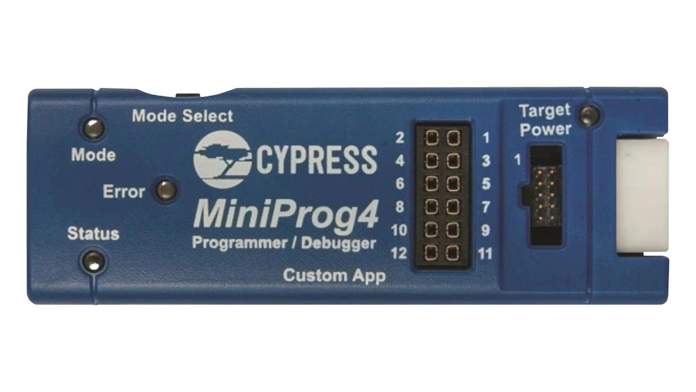
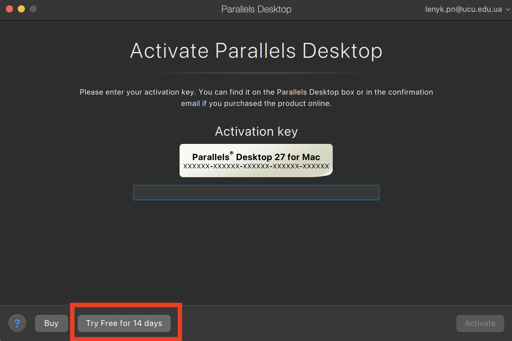

> [!NOTE]
> Це не офіційний гайд, а лише збірка корисних посилань та інструментів для курсів ПОК/АКС на MacOS.
> Я не несу відповідальності за будь-які проблеми, що можуть виникнути при використанні цих інструментів.

> [!WARNING]
> Вимоги з методичних матеріалів викладача є основними. Якщо цей гайд їм суперечить, дотримуйтеся вимог викладача, а не гайду.

# Середовище, на якому тестувався гайд

Усі наведені нижче інструменти я тестував на такому сетапі:

- MacBook Pro (2023)
- Apple M2 Pro
- 16 GB RAM
- macOS Tahoe 26.6.2

> [!NOTE]
> На менш потужних Mac, особливо MacBook Air з 8 GB RAM, одночасний запуск
> IDE, віртуальної машини, Docker та інших інструментів може працювати
> повільніше або створювати відчутне навантаження на систему.
>
> Це не означає, що виконувати лабораторні на MacBook Air неможливо,
> але варто уникати одночасного запуску кількох важких середовищ і,
> за можливості, виділяти віртуальній машині помірну кількість ресурсів.

# IDE

C/C++: CLion. Перевага CLion у тому, що він має вбудовану підтримку CMake, clangd, який дає підказки та автодоповнення.

Все це саме можна відтворити у VSCode за допомогою розширень, але CLion надає це з коробки, що було зручно для мене.

# Додаткові інструменти

[Tools](tools) — містить додаткові інструменти, повʼязані з розробкою на C/C++.

- `clang-format` — інструмент для автоматичного форматування коду відповідно до заданих правил.
- `clang-tidy` — інструмент для статичного аналізу коду, який допомагає знаходити потенційні помилки та проблемні конструкції.
- `pre-commit` — інструмент для автоматичного запуску перевірок перед комітом.
- `isort` — інструмент для автоматичного сортування імпортів у Python-коді.
- `black` — інструмент для автоматичного форматування Python-коду.

> [!NOTE]
> `clang-format` та `clang-tidy` не є обовʼязковими для виконання лабораторних робіт.
>
> `clang-format` я рекомендую використовувати: він переважно змінює лише оформлення
> коду — відступи, переноси рядків, розташування дужок, форматування параметрів,
> `#include` тощо. Це зручний спосіб підтримувати код у єдиному стилі.

> [!WARNING]
> На ПОК я б не рекомендував бездумно застосовувати `clang-tidy` з великим набором
> перевірок або автоматичними `fix-it`.
>
> Курс навмисно використовує низькорівневі конструкції C/C++, зокрема:
>
> - сирі вказівники (`raw pointers`)
> - C-масиви
> - арифметику вказівників
> - ручну роботу з памʼяттю
> - C API та `extern "C"`
> - низькорівневі перетворення типів
> - роботу з ABI та асемблером.
>
> Частина перевірок `clang-tidy` вважає такі конструкції небажаними в сучасному
> прикладному C++, хоча в межах ПОК вони можуть бути частиною самого завдання.
>
> Тому конфігурацію `clang-tidy` варто підбирати під конкретний проєкт і уважно
> переглядати кожне попередження перед застосуванням автоматичних виправлень.
> Конфігурація в цьому репозиторії наведена лише як приклад. Хоча може бути використана для лабораторних на курсі АКС.

## Приклад конфігів:

[.clang-format](tools/.clang-format-example)

[.clang-tidy](tools/.clang-tidy-example)

[.pre-commit-config.yaml](tools/.pre-commit-config-example.yaml)

Інструкція з налаштування та використання цих інструментів наведена у [SETUP.md](tools/SETUP.md).

## Корисно для ПОК

- [GCC, binutils та робота з бінарними файлами](https://learn.ucu.edu.ua/pluginfile.php/193338/mod_resource/content/3/cpp1_app_binutils_n_gcc.pdf) – матеріал допоможе краще зрозуміти, що відбувається між компіляцією, object files, linking і binary utilities.
- [Матеріал про GDB](https://learn.ucu.edu.ua/mod/page/view.php?id=103611) – варто ще до лабораторних з асемблером освоїти breakpoints, `run`, `continue`, `step`/`next`, перегляд регістрів, памʼяті та disassembly.

> [!NOTE]
> Цей гайд не замінює LMS ПОК. Якщо в матеріалах курсу трапляється інструмент,
> якого тут немає, вам потрібно буде навчитися його запускати або знайти
> відповідний аналог для своєї системи. Я не намагаюся описати тут усі
> інструменти й варіанти їх запуску – це було б нереально.
>
> Натомість тут зібраний стартовий setup, який прибирає багато рутини й
> економить час на початку.

# [UTM](https://mac.getutm.app/)

UTM потрібен, якщо ви хочете мати повноцінне Linux-середовище у віртуальній машині.

Для Mac на Apple Silicon основний рекомендований у цьому гайді сценарій –
`Virtualize` з Ubuntu ARM64. У цьому режимі UTM використовує апаратну
віртуалізацію, а гостьова система має ту саму ARM64-архітектуру, що й процесор
Mac. Це швидший і менш вимогливий варіант, але він не створює x86_64 VM.
Покрокове налаштування описане в
[інструкції для Ubuntu ARM64](utm/arm64.md).

Режим `Emulate` імітує процесор іншої архітектури та дозволяє запустити
повноцінну x86_64 Ubuntu на Apple Silicon. Така VM зазвичай працює повільніше й
потребує більше ресурсів. Цей сценарій буде описаний в
[інструкції для Ubuntu x86_64](utm/x86-64.md).

Для x86_64 я використовую Ubuntu Server з увімкненим `OpenSSH server`, а
працюю з ним через розширення VS Code
[Remote - SSH](https://code.visualstudio.com/docs/remote/ssh). Під час першого
підключення воно встановлює VS Code Server у VM, тому можна редагувати код,
відкривати terminal і запускати extensions зі звичайного VS Code на macOS без
окремого desktop GUI в x86_64 VM.

> [!NOTE]
> У моєму тесті встановлення x86_64 Ubuntu Server і підключення через VS Code
> зайняли понад годину. Повний ARM64 setup через `Virtualize` зайняв 15 хвилин.

## Рекомендовані ресурси VM

Це лише мої стартові рекомендації. Ви можете змінювати їх залежно від свого Mac
і вимог конкретної лабораторної.

Для ПОК:

- RAM: `4096 MiB`;
- CPU: `4 vCPU`;
- Storage: `32–64 GiB`.

Для АКС:

- RAM: `6144–8192 MiB`;
- CPU: `4–6 vCPU`;
- Storage: `40–64 GiB`.

На Mac з 8 GB RAM не варто виділяти VM всі 8 GB. Краще орієнтуватися приблизно
на 3–4 GB guest RAM.

# [Parallels Desktop](https://www.parallels.com/products/desktop/)

## Лабораторні з мікроконтролерами на macOS

Найскладніша частина ПОК для macOS – лабораторні з мікроконтролерами. Проте
їх можна виконати повністю самостійно.

Основна проблема в тому, що PSoC Creator не підтримує macOS. Його можна
запустити у Windows ARM VM через Parallels Desktop. Щоб запрограмувати
мікроконтролер, програматор потрібно передати у Windows VM через USB: напряму
з macOS це не працюватиме.

## Програматор PSoC



Це універсальний програматор для мікроконтролерів Infineon PSoC 4/6. Він
підключається до Mac через USB, підтримує macOS і може бути корисним для
лабораторних з мікроконтролерами. Його можна взяти в 009. Особисто я
використовував його для лабораторних з мікроконтролерами на курсі ПОК.

[Сторінка програматора CY8CKIT-005-A](https://www.infineon.com/evaluation-board/CY8CKIT-005-A)

## Який setup обрати

Якщо у вас є програматор, рекомендую Parallels Desktop з Windows ARM і PSoC
Creator. Так ви зможете і писати код, і програмувати мікроконтролер через USB.

Якщо Parallels Desktop є, але програматора немає, код можна підготувати у VM,
а для програмування знайти людину зі звичайним x86 Windows PC. Інший варіант –
Windows x86 через UTM, але вона працює дуже повільно.

## Parallels Desktop not free

В ньому є 14 днів безкоштовного тестового періоду. Найцікавіще, що ви можете міняти акаунти і отримувати ще 14 днів. Тобто ви можете створити новий акаунт і отримати ще 14 днів. І так далі.



Порада

```
namesurname.pn@ucu.edu.ua
```

```
name.surname.pn@ucu.edu.ua
```

```
name.surna.me.pn@ucu.edu.ua
```

Рахуються, як різні акаунти. Тобто ви можете створити новий акаунт і отримати ще 14 днів.

Parallels Desktop - дуже чудова програма, яка працює без лагів і нею дуже примєно користуватися. Тому напевно варто її використовувати, якщо у вас є програматор. Бо тоді ви можете запускати PSoC Creator на MacOS і програмувати мікроконтролер.

Встановлення дуже просте вам не потрібно буде нічого налаштовувати і качати ISO образи. Бо Parallels Desktop самостійно встановлює Windows. Просто натискаєте кнопку.

## PSoC Creator

[PSoC Creator](https://www.infineon.com/design-resources/development-tools/sdk/psoc-software/psoc-creator) - офіційне середовище розробки для мікроконтролерів Infineon. Тільки під Windows. На нього гайду не буде самі розберетеся.

# Cutter

[Cutter](https://cutter.re/) - графічний frontend для [radare2](https://rada.re/n/), який дозволяє аналізувати бінарні файли, переглядати disassembly, досліджувати структуру програм, встановлювати breakpoints та виконувати інші дії, пов'язані з реверс-інжинірингом. Може бути корисним для лабораторних з асемблером. Він не не дасть змогу вирішити всю лабораторну. Але просто подивитись на disassembly, структуру програми та інші речі зручно через GUI. Можна встановити на macOS, Windows та Linux. Для повного виконання можна брати gdb (x86_64), але для цього потрібно буде вставновити будь яке Linux середовище, що описано вище.
