# Ubuntu ARM64 в UTM на Apple Silicon

Цей гайд описує основний сценарій для Mac на Apple Silicon: UTM -> `Virtualize` ->
Ubuntu ARM64.

## 1. Ubuntu ISO

Завантажте Ubuntu Desktop з [офіційної сторінки Ubuntu](https://ubuntu.com/download/desktop).
На момент написання гайду актуальна версія – Ubuntu 26.04.1 LTS.

Для цього сценарію виберіть саме `ARM 64-bit architecture`, а не
`Intel or AMD 64-bit architecture`.

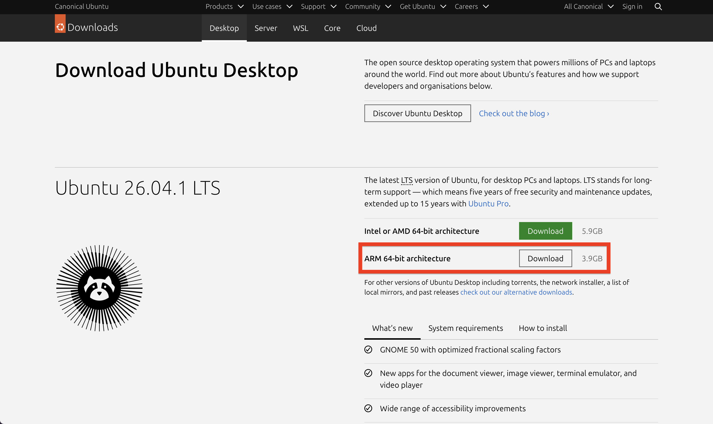

## 2. Створення VM

У UTM натисніть `+`, виберіть `Virtualize`, а потім `Linux`. Як boot ISO
вкажіть завантажений ARM64-образ Ubuntu.

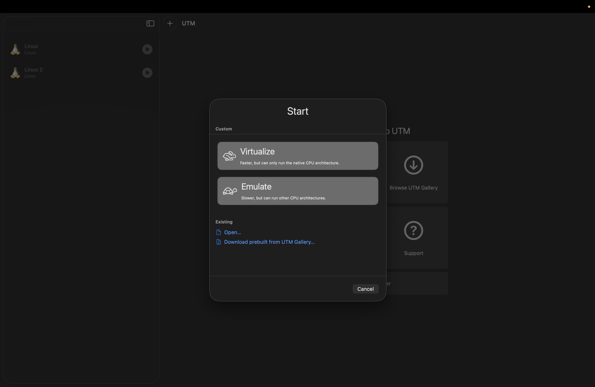

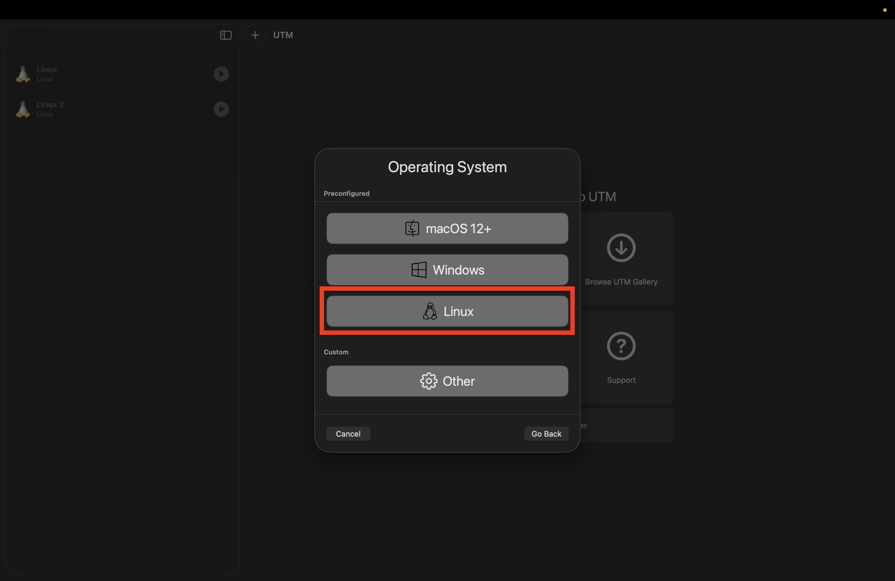

### Display та OpenGL

`Enable display output` залишайте ON для Ubuntu Desktop.

> [!NOTE]
> На моєму M2 Pro я перевірив Ubuntu з `Enable hardware OpenGL acceleration`
> і без нього. Помітної різниці у звичайній роботі GUI не побачив.
>
> На інших моделях Mac, версіях Ubuntu або UTM поведінка може відрізнятися.
> Сам UTM попереджає, що деякі Linux drivers можуть спричиняти black screen,
> broken compositing або проблеми з відображенням програм. Якщо з OpenGL є
> проблеми, вимкніть `Enable hardware OpenGL acceleration`.

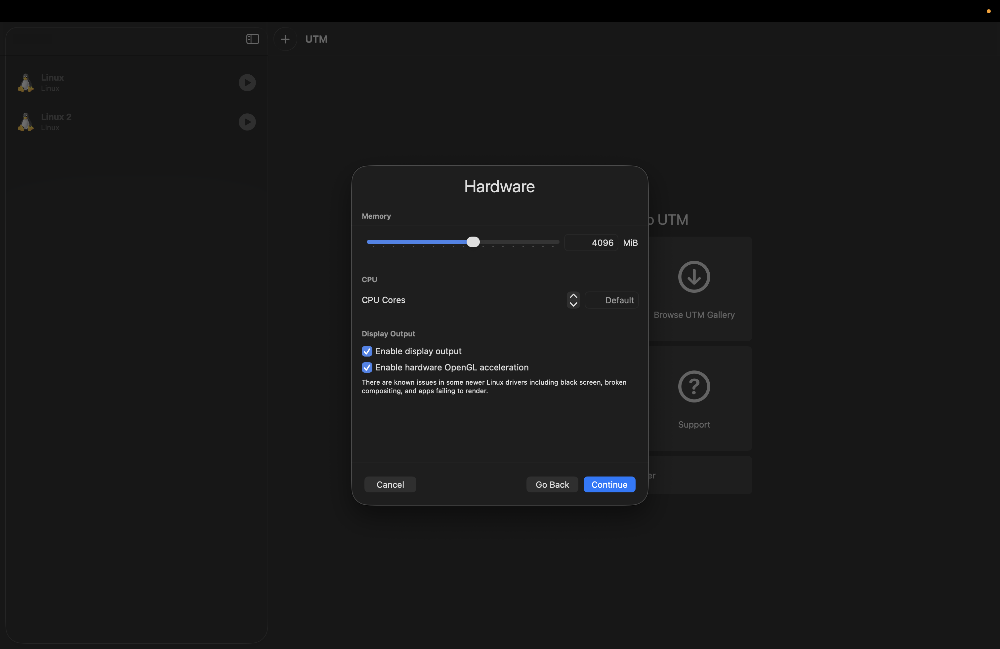

## 3. Apple Virtualization та Rosetta

Для цього гайду рекомендовані такі параметри:

- `Use Apple Virtualization` – ON;
- `Enable Rosetta (x86_64 Emulation)` – ON.

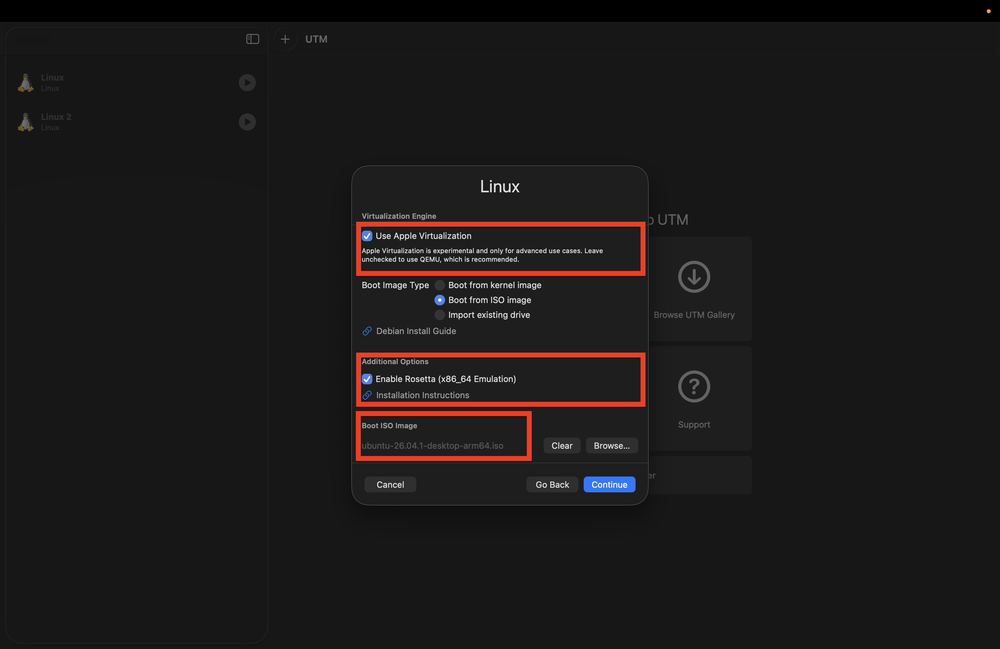

VM при цьому залишається ARM64 Linux.

Rosetta не перетворює систему на x86_64. Вона дозволяє запускати x86_64 Linux
executables усередині ARM64 Linux VM і працює через Apple Virtualization
backend.

Детальніше:

- [Rosetta в документації UTM](https://docs.getutm.app/advanced/rosetta/)
- [Rosetta в документації Apple](https://support.apple.com/uk-ua/102527)

## 4. Встановлення Rosetta на macOS

Rosetta має бути доступною на host macOS. Це не окрема програма або `.dmg` для
завантаження: якщо Rosetta ще не встановлена, macOS може запропонувати
встановити її при запуску Intel-компонента. Деталі є в
[інструкції Apple](https://support.apple.com/uk-ua/102527).

Rosetta також можна встановити вручну через Terminal, що я рекомендую зробити:

```bash
softwareupdate --install-rosetta --agree-to-license
```

Не потрібно вмикати Finder option `Open using Rosetta` для самого `UTM.app`.

## 5. Встановлення Ubuntu

Підозрюю, що більшість із вас уже знає, як пройти звичайний Ubuntu installer.
Але якщо ви вперше налаштовуєте Linux, нижче я коротко показав, що саме обирав.

Якщо тут для вас усе знайоме, можете одразу перейти до
[налаштування Rosetta всередині Ubuntu](#6-%D0%BD%D0%B0%D0%BB%D0%B0%D1%88%D1%82%D1%83%D0%B2%D0%B0%D0%BD%D0%BD%D1%8F-rosetta-%D0%B2%D1%81%D0%B5%D1%80%D0%B5%D0%B4%D0%B8%D0%BD%D1%96-ubuntu).

Спочатку оберіть зручну для себе мову. На скриншоті я залишив `English`, але це
не обовʼязково.

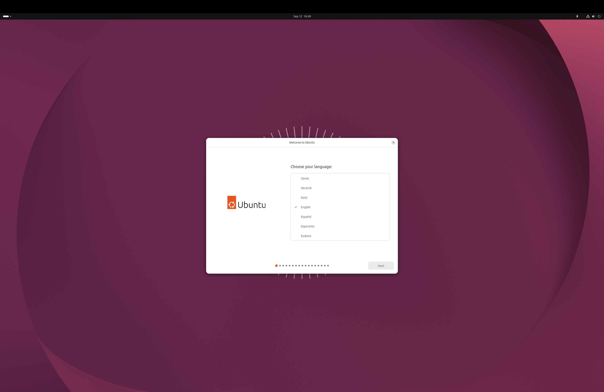

Accessibility settings можна залишити без змін або налаштувати під себе.

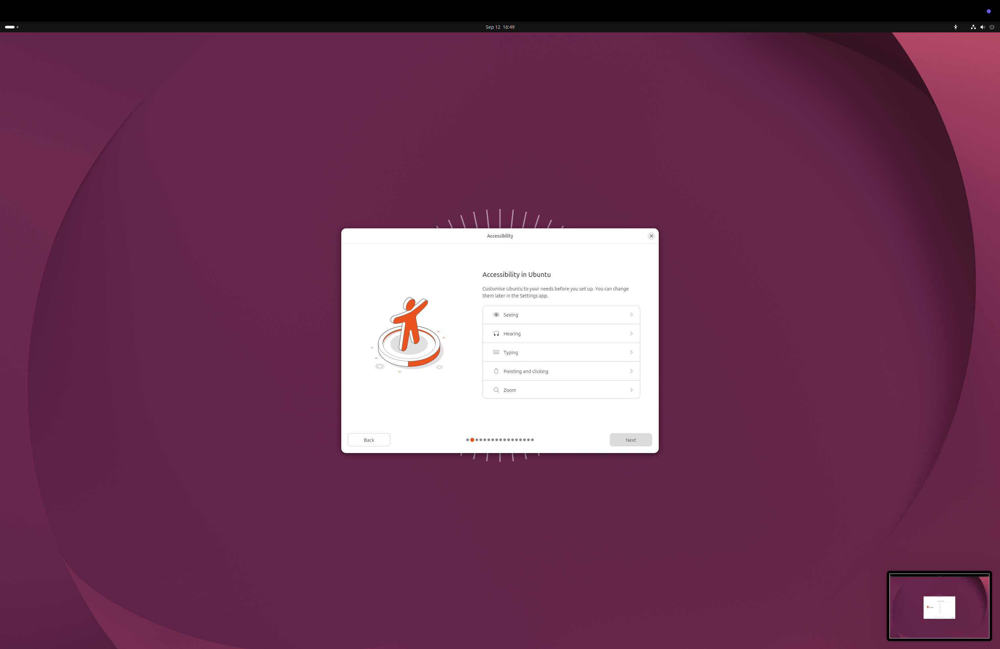

Оберіть свою keyboard layout. Я використовую `English (US)`.

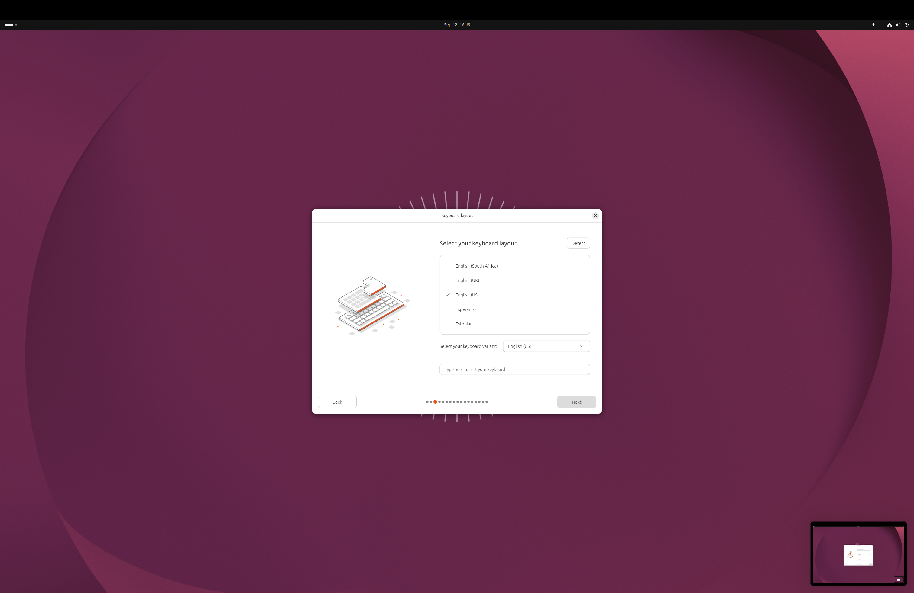

UTM показує мережу VM як wired connection, навіть якщо сам Mac підключений через
Wi-Fi. Оберіть `Use wired connection`.


Оберіть `Install Ubuntu`, а не `Try Ubuntu`.

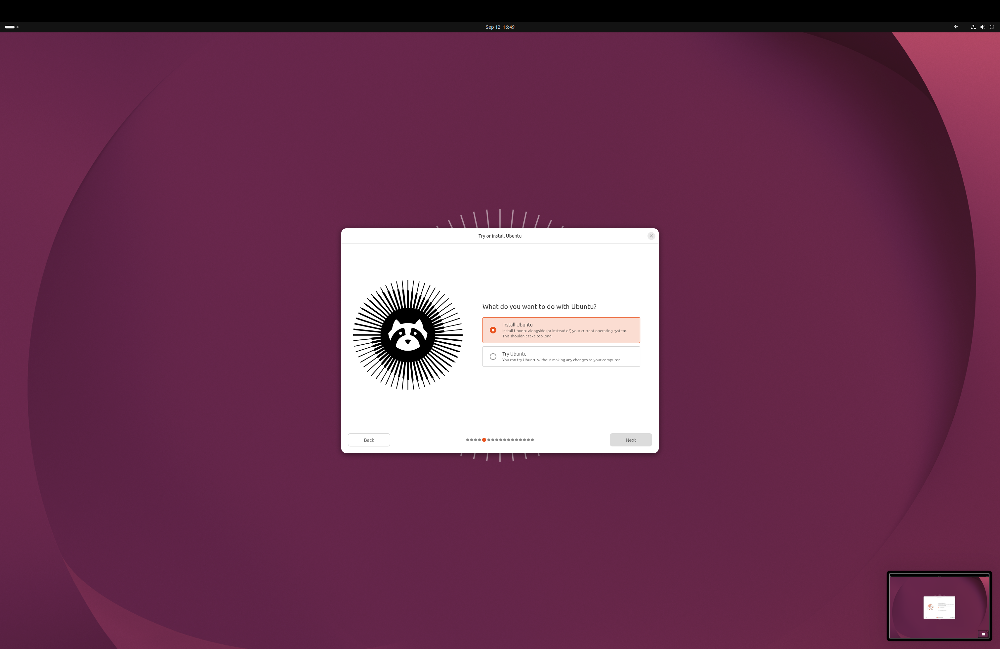

Для звичайного встановлення оберіть `Interactive installation`.

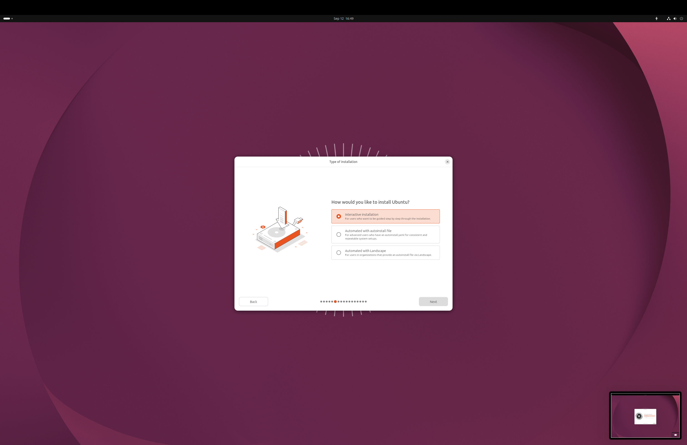

`Default selection` достатньо для лабораторних. Решту програм можна встановити
пізніше.


Я залишаю обидві опції для proprietary software та additional media formats
увімкненими.


Оберіть `Erase disk and install Ubuntu`. У цьому випадку стирається лише
virtual disk, створений для VM у UTM, а не диск вашого Mac.

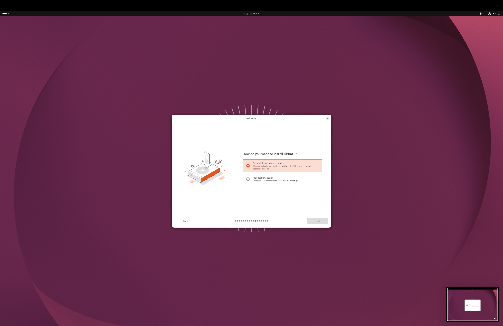

Для лабораторної VM я обираю `No encryption`. За бажанням диск можна
зашифрувати, але тоді потрібно буде вводити окрему passphrase.


Виберіть свій timezone. Для України це `Europe/Kyiv`.

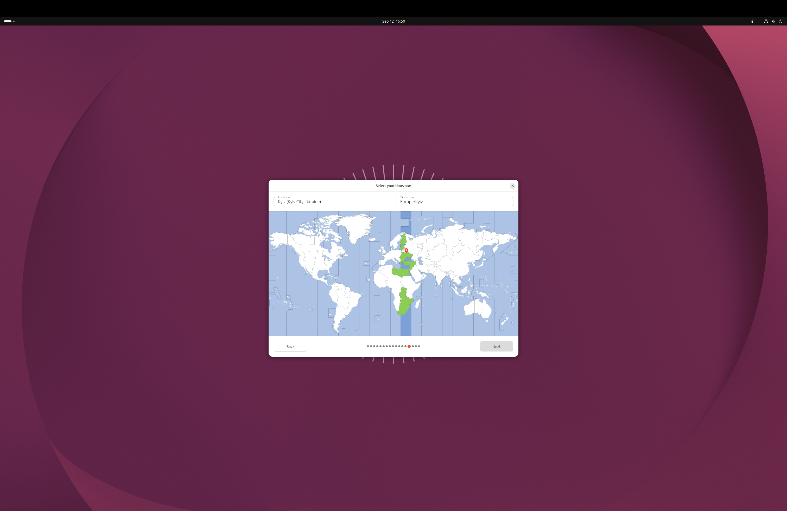

Далі створіть користувача та пароль. Запамʼятайте пароль, бо він знадобиться
для команд через `sudo`.

Наприкінці installer запропонує `Restart Now` або `Continue Testing`. Оберіть
`Restart Now`.

Коли під час перезавантаження побачите логотип Ubuntu, у меню UTM відкрийте
`Virtual Machine`, потім `Drives`, виберіть Ubuntu ISO, з якого запускали
installer, і натисніть `Eject`. Після цього VM завантажиться вже з virtual disk.

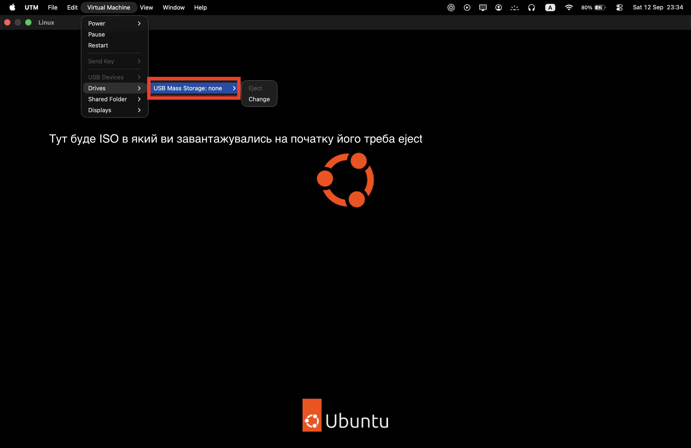

Коли Ubuntu завантажиться з virtual disk, відкрийте Terminal і оновіть список
пакетів та встановлені пакети:

```bash
sudo apt update
sudo apt upgrade
```

## 6. Налаштування Rosetta всередині Ubuntu

Однієї галочки в UTM недостатньо. Rosetta runtime передається guest-системі
через VirtioFS, тому його потрібно підключити й зареєструвати як handler для
x86_64 ELF-файлів.

```bash
sudo apt install binfmt-support

sudo mkdir -p /media/rosetta
sudo mount -t virtiofs rosetta /media/rosetta
```

Після цього зареєструйте Rosetta:

```bash
sudo /usr/sbin/update-binfmts --install rosetta /media/rosetta/rosetta \
    --magic "\x7fELF\x02\x01\x01\x00\x00\x00\x00\x00\x00\x00\x00\x00\x00\x02\x00\x3e\x00" \
    --mask "\xff\xff\xff\xff\xff\xfe\xfe\x00\xff\xff\xff\xff\xff\xff\xff\xff\xfe\xff\xff\xff" \
    --credentials yes --preserve yes --fix-binary yes
```

Для сучасних версій macOS документація UTM використовує `--preserve yes`.
Пояснення параметрів є в
[офіційній інструкції UTM](https://docs.getutm.app/advanced/rosetta/).

Щоб VirtioFS share автоматично монтувався після reboot, можна додати в
`/etc/fstab`:

```text
rosetta /media/rosetta virtiofs ro,nofail 0 0
```

Це optional налаштування; для першої перевірки достатньо ручного mount.

Щоб перевірити Rosetta на простому C++ прикладі, встановіть cross-compiler,
binutils та `gdb-multiarch`.

```bash
sudo apt install gcc-x86-64-linux-gnu g++-x86-64-linux-gnu \
    binutils-x86-64-linux-gnu gdb-multiarch
```

Створіть тестову програму:

```bash
echo '#include <iostream>

int main() {
    std::cout << "Hello x86" << std::endl;
    return 0;
}' > hello_x86.cpp
```

Скомпілюйте її в x86_64 binary. Опція `-static` дозволяє цьому тесту не
залежати від додаткових x86_64 shared libraries:

```bash
x86_64-linux-gnu-g++ -static hello_x86.cpp -o hello_x86
```

Перевірте архітектуру binary:

```bash
file ./hello_x86
```

Результат має містити `x86-64` і може виглядати так:

```text
ELF 64-bit ... x86-64 ... statically linked ...
```

Тепер запустіть програму:

```bash
./hello_x86
```

Очікуваний результат:

```text
Hello x86
```

Якщо програма запускається, x86_64 translation через Rosetta працює.

## 7. x86_64 binaries та libraries

Rosetta виконує x86_64 instructions, але не перетворює ARM64 Ubuntu на
повноцінну x86_64 Ubuntu. Для dynamically linked x86_64 executables можуть
знадобитися відповідні x86_64 shared libraries через `multiarch` або
`multilib`.

Тому не кожен amd64 package чи executable автоматично запрацює одразу після
ввімкнення Rosetta.

## 8. Інструменти для x86_64

Більшість звичайного C/C++ коду можна писати на macOS, а тестувати в Ubuntu,
або працювати повністю в Ubuntu – як вам зручніше. Мені було зручніше писати й
запускати код одразу в Ubuntu.

У ARM64 Ubuntu звичайний `gcc` компілює ARM64 executable. Cross-toolchain не
потрібен для звичайної роботи, але може знадобитися, якщо конкретна лабораторна
вимагає саме x86_64 binary. Команди встановлення та перевірки наведені в
[секції про налаштування Rosetta](#6-%D0%BD%D0%B0%D0%BB%D0%B0%D1%88%D1%82%D1%83%D0%B2%D0%B0%D0%BD%D0%BD%D1%8F-rosetta-%D0%B2%D1%81%D0%B5%D1%80%D0%B5%D0%B4%D0%B8%D0%BD%D1%96-ubuntu).

Для debugging кількох target architectures використовуйте `gdb-multiarch`.
Звичайний ARM64 `gdb` не варто автоматично вважати x86 debugger. За бажанням
можна додати окремі aliases, які явно показують вибраний toolchain:

```bash
alias gcc-x86='x86_64-linux-gnu-gcc'
alias g++-x86='x86_64-linux-gnu-g++'
```

Не замінюйте звичайний `gcc` через `alias gcc=...`: так легко непомітно змінити
архітектуру build.

## 9. Корисно для ПОК

- [GCC, binutils та робота з бінарними файлами](https://learn.ucu.edu.ua/pluginfile.php/193338/mod_resource/content/3/cpp1_app_binutils_n_gcc.pdf) – матеріал допоможе краще зрозуміти, що відбувається між компіляцією, object files, linking і binary utilities.
- [Матеріал про GDB](https://learn.ucu.edu.ua/mod/page/view.php?id=103611) – варто ще до лабораторних з асемблером освоїти breakpoints, `run`, `continue`, `step`/`next`, перегляд регістрів, памʼяті та disassembly.

## 10. Fallback: стандартні налаштування QEMU

> [!NOTE]
> Якщо Apple Virtualization або Rosetta створюють проблеми на конкретному Mac,
> можна створити ARM64 VM зі стандартними налаштуваннями UTM: залишити
> `Use Apple Virtualization` вимкненим і використовувати рекомендований UTM
> QEMU backend. Ubuntu ARM64 при цьому нормально працюватиме.
>
> VM усе ще буде ARM64, а не emulated x86. Описаний вище Rosetta for Linux
> setup через Apple Virtualization у такому режимі недоступний, тому transparent
> запуск x86_64 Linux binaries через нього не працюватиме.

## 11. Примітка для АКС

> [!NOTE]
> Для АКС вам не потрібна повноцінна x86_64 Ubuntu VM. Якщо вимоги курсу
> не зміняться, ARM64 Ubuntu через `Virtualize` достатньо для виконання
> лабораторних.
>
> Водночас уважно перевіряйте, що ваш код компілюється і працює у середовищі,
> яке вимагає конкретна лабораторна. ARM64 та x86_64 – різні архітектури, тому
> не варто автоматично вважати, що код, який зібрався на ARM64, гарантовано
> так само збереться або поводитиметься на x86_64.
>
> Якщо в умові конкретної лабораторної буде явно вказана архітектура x86_64
> або використання x86-специфічних інструкцій, асемблера чи ABI, тоді
> використовуйте відповідний x86_64 toolchain або окремий x86_64 setup.

Для звичайного C/C++ коду на АКС ARM64 Ubuntu – основний рекомендований setup
у цьому гайді.
